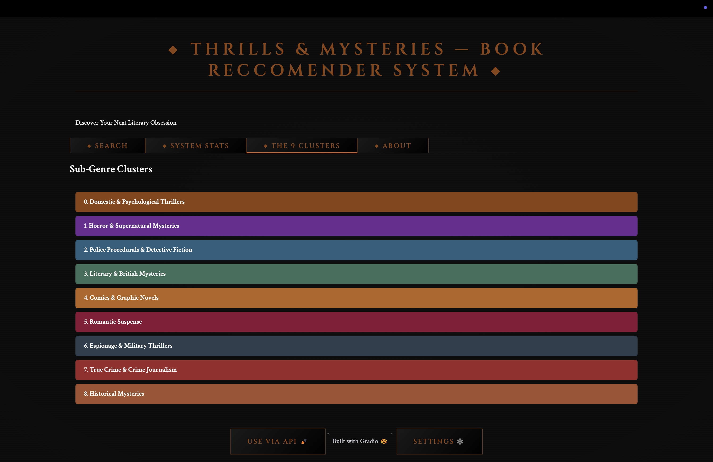
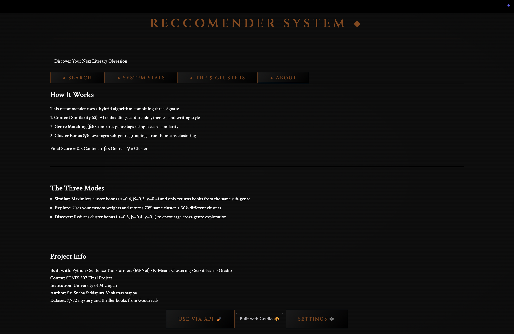
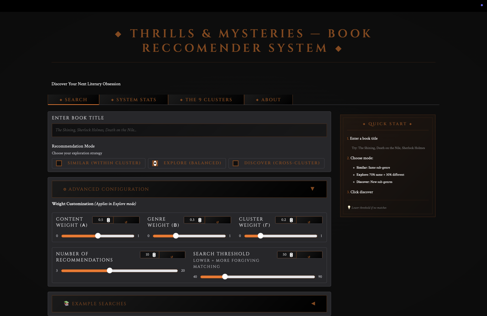
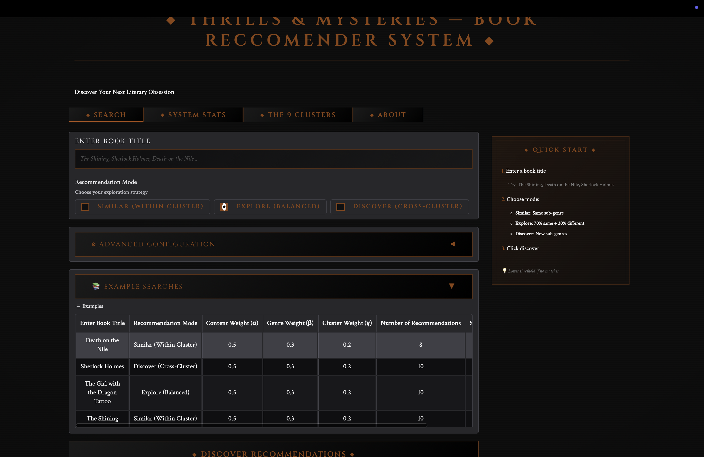
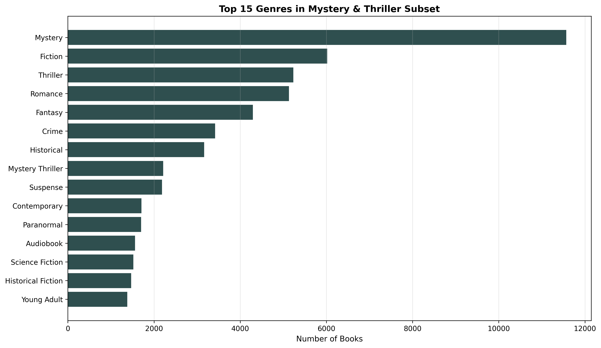
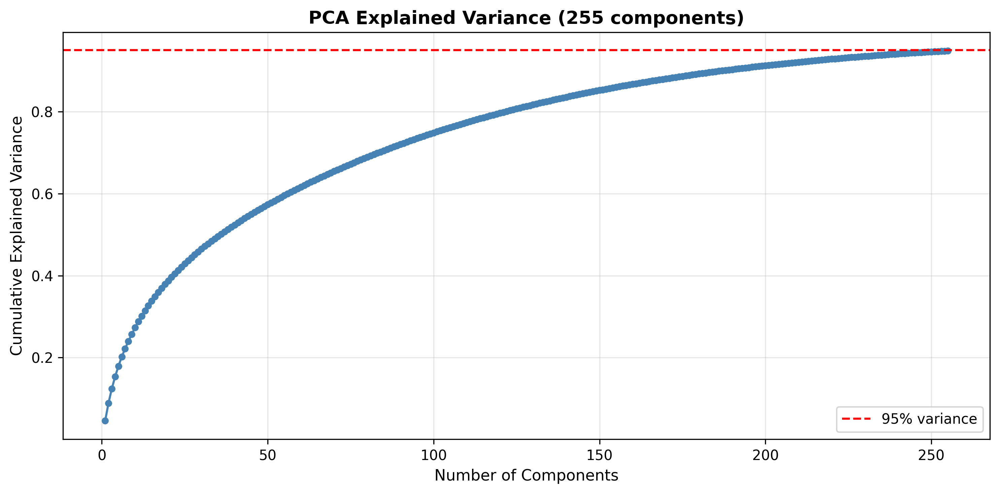
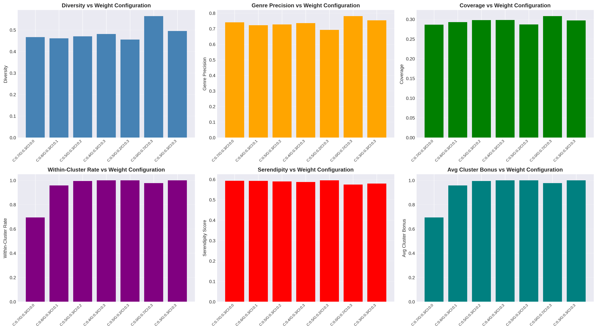
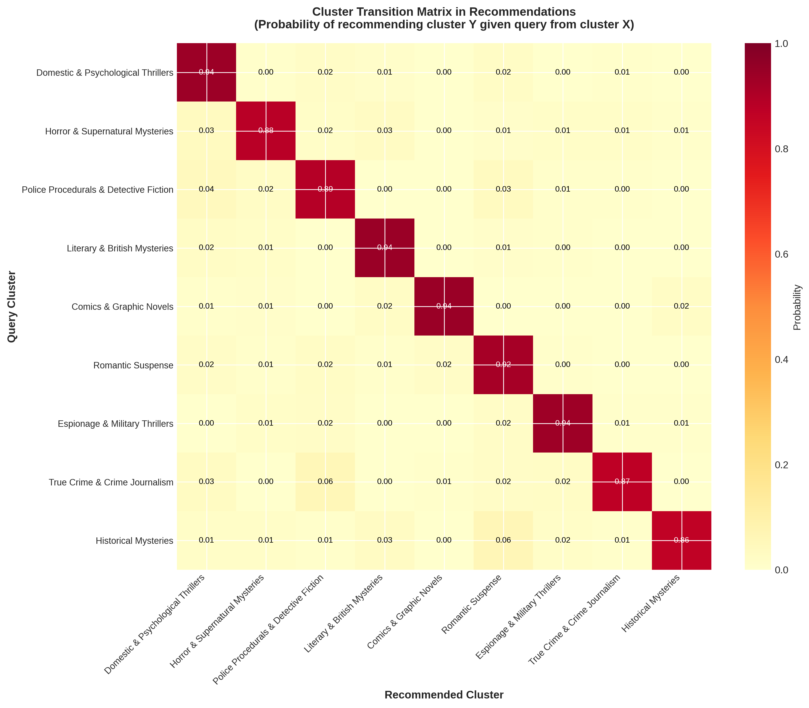

# Cluster-Aware Hybrid Recommendation System for Mystery and Thriller Books

> **DATASCI 507 Final Project** | University of Michigan | Fall 2025  
> **Author:** Sai Sneha Siddapura Venkataramappa  
> **Course:** Data Science Analytics using Python

---

## 📖 Overview

This project presents a **cluster-aware hybrid recommendation system** specifically designed for mystery and thriller books. By combining content-based embeddings, genre similarity, and sub-genre clustering, the system delivers personalized book recommendations that balance relevance with discovery.

### Key Features

* **Hybrid scoring algorithm** combining three signals: semantic embeddings (α), genre overlap (β), and cluster membership (γ)
* **9 distinct sub-genres** identified through K-Means clustering (Psychological Thrillers, Horror, Police Procedurals, etc.)
* **Three recommendation modes**: Similar (within-cluster), Explore (balanced), Discover (cross-cluster)
* **Interactive Gradio web app** with fuzzy search, live cover images, and explainability features
* **Statistically validated** with p=0.013 improvement over baselines

### Performance Metrics

* **Genre Precision:** 76.9%
* **Diversity Score:** 0.479
* **Within-Cluster Rate:** 91.9%
* **F1-Score:** 0.732
* **Hit Rate:** 95.0%

---

## 🗂️ Repository Structure

```
mystery-thriller-book-recommendation-system/
│
│
├── notebook-1-data-processing.ipynb        # Data preprocessing & EDA
├── notebook-2-embeddings.ipynb             # Embedding generation & clustering
├── notebook-3-recommender.ipynb            # Hybrid system & evaluation
├── notebook-4-gradio-app.ipynb             # Interactive web application
│
├── checkpoints/                            # Saved model states
│   ├── checkpoint_1_data_prepared.pkl
│   ├── checkpoint_2_embeddings.pkl
│   └── checkpoint_3_evaluation.pkl
│   └── df_mt-2.pkl
│   └── df_test-2.pkl
│   └── df_train-2.pkl
│   └── metadata-2.pkl
│
├── embeddings/                             # Pre-computed embeddings
│   ├── miniLM/
│   │   ├── train_embeddings.npy
│   │   └── test_embeddings.npy
│   └── mpnet/
│   │   ├── train_embeddings.npy
│   │   └── test_embeddings.npy
│   │ 
│   ├── umap_coords.npy
│   ├── umap_sample_indices.npy
│
├── graphs/                                  # Visualizations
│   ├── top_genres_mt.png
│   ├── pca_explained_variance.png
│   ├── umap_kmeans_clusters.png
│   ├── weight_parameter_sweep.png
│   └── cluster_transition_matrix.png
│
│── documentation/ 
│    └── paper.pdf                           # IEEE project report
├── requirements.txt                         # Python dependencies
├── README.md                                # This file

```

---

## 🎨 Gradio App Screenshots

**Don't want to run the code?** Here's a complete visual walkthrough of the interactive recommendation system!

### 1. Main Search Interface


*The mystery-themed search interface. Features include: book title search with fuzzy matching, three recommendation modes (Similar/Explore/Discover), collapsible Advanced Configuration panel, Example Searches section, and Quick Start guide on the right.*

### 2. Search Results with Book Match


*Fuzzy search successfully finds "Hercule Poirot's Christmas" with the input "Hercule Poiroit" by Agatha Christie with 68.29% match confidence. The system identifies it as Cluster 0: Domestic & Psychological Thrillers. The input book card displays the cover, rating (3.97), cluster information, and full genre tags.*

### 3. Top 10 Recommendations Table


*Top 10 recommendations displayed in a structured table showing: Rank, Cover image, Title & Author, Cluster badge (with cross-cluster indicators), Book description excerpt, and detailed Scores breakdown (Content, Genre, Cluster, Total). Example: "Elephants Can Remember" scores 0.607 total with Content=0.562, Genre=0.769, Cluster=0.0 (cross-cluster).*

### 4. System Statistics Dashboard


*The System Statistics tab shows key performance metrics:*
- *Total Books: 7,772 Mystery & Thriller titles*
- *Clusters: 9 distinct sub-genres*
- *Model: MPNet (Sentence Transformer)*
- *Diversity Score: 0.479*
- *Genre Precision: 76.9%*
- *Within-Cluster Rate: 91.9%*

*Includes explanations of what each metric means for recommendation quality.*

### 5. The 9 Clusters Visualization


*Visual representation of all 9 sub-genre clusters with color-coded bars:*
- *0. Domestic & Psychological Thrillers (brown)*
- *1. Horror & Supernatural Mysteries (purple)*
- *2. Police Procedurals & Detective Fiction (blue)*
- *3. Literary & British Mysteries (teal)*
- *4. Comics & Graphic Novels (orange)*
- *5. Romantic Suspense (burgundy)*
- *6. Espionage & Military Thrillers (dark blue)*
- *7. True Crime & Crime Journalism (red)*
- *8. Historical Mysteries (brown)*

### 6. About Section - How It Works


*Explanation of the hybrid algorithm combining three signals:*
1. *Content Similarity (α): AI embeddings capture plot, themes, and writing style*
2. *Genre Matching (β): Compares genre tags using Jaccard similarity*
3. *Cluster Bonus (γ): Leverages sub-genre groupings from K-means clustering*

*Shows the final scoring formula and explains the three recommendation modes with their different weight configurations.*

### 7. Advanced Configuration Panel


*Power users can fine-tune recommendations with sliders for:*
- *Content Weight (α): 0.5 (controls semantic similarity importance)*
- *Genre Weight (β): 0.3 (controls genre matching importance)*
- *Cluster Weight (γ): 0.2 (controls within-cluster bonus)*
- *Number of Recommendations: 10 (range 3-20)*
- *Search Threshold: 50 (fuzzy matching tolerance, 40-90)*

*Note: "Applies in Explore mode" indicates these custom weights are used when Explore mode is selected.*

### 8. Example Searches Reference Table


*Pre-configured example queries demonstrating different use cases:*
- *Death on the Nile → Similar (Within Cluster) mode*
- *Sherlock Holmes → Discover (Cross-Cluster) mode*
- *The Girl with the Dragon Tattoo → Explore (Balanced) mode*
- *The Shining → Similar (Within Cluster) mode*

*The user can click on any of these examples to perform a quick search. Each example shows the recommended mode and custom weight configurations for optimal results.*

---

## Quick Start

### 1. Clone Repository

```bash
git clone https://github.com/saisnehasv/mystery-thriller-book-recommendation-system.git
cd mystery-thriller-book-recommendation-system
```

### 2. Install Dependencies

```bash
pip install -r requirements.txt
```

### 3. Choose Your Path

#### Option A: Just Try the App (5 minutes) ⚡

**For quick demo - uses pre-computed checkpoints**

```bash
jupyter notebook notebook-4-gradio-app.ipynb
```

The Gradio interface will launch automatically at a public Gradio link.

**No need to run other notebooks** - Notebook 4 loads from saved checkpoints and embeddings!

---

#### Option B: Full Pipeline from Scratch (2-3 hours) 🔬

**For complete reproducibility - regenerates everything**

Run notebooks sequentially:

```bash
# Step 1: Data preprocessing & EDA (~20 min)
jupyter notebook notebook-1-data-processing.ipynb

# Step 2: Generate embeddings & clustering (~40 min with GPU, ~2 hrs CPU)
jupyter notebook notebook-2-embeddings.ipynb

# Step 3: Build recommender & evaluate (~30 min)
jupyter notebook notebook-3-recommender.ipynb

# Step 4: Launch Gradio app (~5 min)
jupyter notebook notebook-4-gradio-app.ipynb
```

**Note:** Notebooks save checkpoints after each stage, so you can resume if interrupted.

---

## 📊 Dataset

**Source:** [Goodreads 100k Dataset](https://huggingface.co/datasets/euclaise/goodreads_100k)

**Processing Pipeline:**

1. Filtered for "Mystery" and "Thriller" genres (9,088 initial books)
2. Language detection (retained English-only: 7,772 books)
3. Quality filtering (min 50 chars description, min 10 ratings)
4. Train-test split: 80/20 (6,217 train, 1,555 test)

**Final Dataset Statistics:**

* **Total Books:** 7,772 mystery/thriller titles
* **Unique Genres:** 751 genre tags
* **Avg Rating:** 3.86 ± 0.62
* **Median Description Length:** 811 characters

---

## 🧠 Methodology

### 1. Embedding Generation

* **Model Comparison:** MiniLM (384-dim) vs. MPNet (768-dim)
* **Selected:** MPNet for superior semantic coherence (0.578 vs. 0.515 avg similarity)
* **Optimization:** GPU-accelerated with FP16 precision (122 texts/sec on Tesla T4)

### 2. Dimensionality Reduction

* **PCA:** 255 components (95% variance explained)
* **UMAP:** 2D projection for visualization (n_neighbors=15, min_dist=0.0)

### 3. Clustering

* **Algorithm Comparison:** K-Means vs. HDBSCAN
* **Selected:** K-Means (K=9) for balanced, interpretable clusters
* **Rationale:** HDBSCAN produced 93% mega-cluster due to semantic homogeneity

### 4. Hybrid Scoring Function

```
score(q, r) = α·content_similarity + β·genre_similarity + γ·cluster_bonus
```

* **Default weights:** α=0.5, β=0.4, γ=0.1
* **Content similarity:** Cosine similarity on MPNet embeddings
* **Genre similarity:** Jaccard index on multi-label genre vectors
* **Cluster bonus:** Binary indicator (1 if same cluster, 0 otherwise)

### 5. Recommendation Modes

| Mode | α | β | γ | Strategy |
| --- | --- | --- | --- | --- |
| **Similar** | 0.4 | 0.2 | 0.4 | Within-cluster only |
| **Explore** | 0.5 | 0.4 | 0.1 | 70% within + 30% cross |
| **Discover** | 0.5 | 0.4 | 0.1 | Prioritize cross-cluster |

---

## 📈 Results

### Cluster Sub-genres Identified

0. **Domestic & Psychological Thrillers** (1,226 books)
1. **Horror & Supernatural Mysteries** (517 books)
2. **Police Procedurals & Detective Fiction** (703 books)
3. **Literary & British Mysteries** (908 books)
4. **Comics & Graphic Novels** (327 books)
5. **Romantic Suspense** (900 books)
6. **Espionage & Military Thrillers** (683 books)
7. **True Crime & Crime Journalism** (468 books)
8. **Historical Mysteries** (485 books)

### Evaluation Visualizations

#### Dataset Genre Distribution

*Distribution of the most common genres in the Mystery & Thriller dataset, showing the diversity of sub-genres from classic detective fiction to psychological thrillers and horror.*

#### PCA Dimensionality Reduction

*Cumulative explained variance showing that 255 principal components capture 95% of the variance in the 768-dimensional MPNet embeddings, demonstrating effective dimensionality reduction while preserving semantic information.*

#### UMAP Cluster Visualization

*2D UMAP projection of book embeddings colored by K-Means cluster assignments. The visualization reveals clear separation between sub-genres: horror/supernatural mysteries (purple), literary mysteries (teal), romantic suspense (burgundy), and police procedurals (blue) form distinct regions in the embedding space.*

#### Hyperparameter Optimization

*Grid search results showing how different combinations of content weight (α), genre weight (β), and cluster weight (γ) affect recommendation quality metrics. The optimal configuration (α=0.5, β=0.4, γ=0.1) balances diversity, genre precision, and within-cluster coherence.*

#### Cluster Transition Analysis

*Heat map showing cross-cluster recommendation patterns. Diagonal elements represent within-cluster recommendations (high values indicate strong cluster coherence), while off-diagonal elements reveal natural transitions between related sub-genres. For example, Literary & British Mysteries (Cluster 3) frequently recommend to Police Procedurals (Cluster 2), reflecting thematic overlap.*

### Baseline Comparison

| System | Diversity | Genre Precision | Coverage | Within-Cluster |
| --- | --- | --- | --- | --- |
| Random | 0.714 | 0.245 | 0.001 | — |
| Content-Only | 0.438 | 0.485 | 0.135 | 0.733 |
| Genre-Only | 0.578 | 0.818 | 0.142 | 0.532 |
| Content+Genre | 0.466 | 0.757 | 0.139 | 0.659 |
| **Hybrid (Ours)** | **0.472** | **0.740** | **0.136** | **0.936** |

**Statistical Significance:** Paired t-test shows our hybrid system significantly outperforms Content+Genre baseline (t=2.52, p=0.013, α=0.05)

---

## 🔬 Reproducibility

### Checkpoints

The repository includes checkpointed data at key stages:

1. **checkpoint_1_data_prepared.pkl** – Cleaned train/test data
2. **checkpoint_2_embeddings.pkl** – MPNet embeddings + cluster assignments
3. **checkpoint_3_evaluation.pkl** – Evaluation metrics + results

### Random Seeds

All random operations use seed=42 for reproducibility:

```python
np.random.seed(42)
torch.manual_seed(42)
```

### System Requirements

* **GPU:** NVIDIA Tesla T4 or equivalent (optional, but recommended)
* **RAM:** 16GB minimum (32GB recommended for full dataset)
* **Storage:** ~5GB for embeddings and checkpoints

---

## 📝 Citation

If you use this work, please cite:

```bibtex
@inproceedings{venkataramappa2025cluster,
  title={Cluster-Aware Hybrid Recommendation System for Mystery and Thriller Books},
  author={Venkataramappa, Sai Sneha Siddapura},
  booktitle={STATS 507 Final Project},
  year={2025},
  institution={University of Michigan}
}
```

---

## 📚 References

1. Barkan & Koenigstein (2016). "Item2Vec: Neural item embedding for collaborative filtering." *IEEE MLSP*.
2. Reimers & Gurevych (2019). "Sentence-BERT: Sentence embeddings using Siamese BERT-networks." *EMNLP*.
3. Burke (2002). "Hybrid recommender systems: Survey and experiments." *User Modeling and User-Adapted Interaction*.
4. Bobadilla et al. (2013). "Recommender systems survey." *Knowledge-Based Systems*.

---

## 🤝 Contributing

This is an academic project completed for STATS 507 at the University of Michigan. While not actively maintained, issues and suggestions are welcome.

---

## 📧 Contact

**Sai Sneha Siddapura Venkataramappa**  
Department of Statistics, University of Michigan  
📧 [saisneha@umich.edu](mailto:saisneha@umich.edu)  
🔗 [LinkedIn](https://www.linkedin.com/in/sai-sneha-sv/)

---

## 🙏 Acknowledgments

* **Course:** DATASCI 507 instructors for guidance on ML methodology
* **Tools:** Hugging Face (sentence-transformers), scikit-learn, Gradio
* **Dataset:** Goodreads 100k dataset via Hugging Face Datasets
* **Compute:** Google Colab for GPU access during development

---

**⭐ If you find this project useful, please consider starring the repository!**